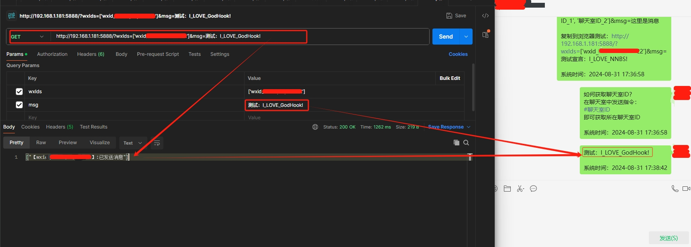

# GodHook / 神引

 
**源仓库：**

✨**一个集成了各种好玩功能的Xposed模块** ✨

1. **自动回复：支持多种AI语言大模型，如DeepSeek、Qwen、Silicon等；**
1. **订阅功能：定时08:30am，推送每日新闻、毒鸡汤、每日天气等你想到的功能；**
1. **接口功能： 通过访问api，执行宿主APP的消息函数，用于运维告警、数据推送等场景；**
1. **各种新功能，待挖掘...**

_**#微信机器人 #自动回复 #AI聊天 #运维告警 #Deepseek #Qwen #智普 #Silicon**_

# GodHook / 神引

## 问题收集

> 1. 在GodHook界面无法调通API
> 
> 答：需要有点技术底子。建议用postman测试可用之后，再来GodHook配置；也有可能是deepseek接口偶尔会超时造成"nnbs返回错误"，建议使用silicon或者qwen来测试。
> 
> 2. #指令可以正确返回消息，但是私聊无法返回消息
>
> 答：在当前聊天框发送【#聊天室ID】，查看返回的ID是否为wxid_xxx，如果不是，那就是不支持，后续会优化；因为当前仅支持wxid_xxx的ID，对老号不太友好。

## 免责声明

> 本项目仅供学习交流，请勿倒卖恶意打包，使用本模块后请24小时内删除

本模块仅适配`Lsposed`，不适配`opatch`或者`lspatch`，如果使用`opatch`或者`lspatch`出现问题请不要在群里提问

---

## 适配的版本

> 当前已适配**谷歌版：wx8.0.49(2681)、wx8.0.49(2685)、wx8.0.48(2589)**，后续适配wx更多版本。
> 网友收集的各APP版本，移步自行找到对应版本：[网盘链接](https://www.123pan.com/s/A6cA-ztAJh) `2025-02-23 17:45:34 更新`

---

## 1.自动回复：接入AI语言大模型

**使用步骤：**

> 1. **在GodHook App首页中，配置大模型信息；并测试成功；**
> 2. **重启wx，绑定需要生效的聊天框：到你想要的聊天框中发送【#绑定聊天室】；**
> 3. **如果聊天室是私聊窗口，那就可以直接聊天；如果是群聊，需要在第一步骤的时候设置生效关键词；**
> 4. 上述的关键词，可以是机器人的wx名称，如机器人的wx名称是【快乐小狗】，那就第一步骤设置的时候就设置【@快乐小狗】
> 5. 在群聊中，成员@快乐小狗，机器人才被触发。
>
> 涉及到的**指令**：
>
> | 功能描述             | 指令                                             | 备注                                                     |
> | -------------------- | ------------------------------------------------ | -------------------------------------------------------- |
> | 绑定对应的聊天室     | #绑定聊天室                                      | 可以是私聊，可以是群聊                                   |
> | 测试可用性           | @测试                                            | 默认关键词，用于测试机器人是否可用                       |
> | 单独聊天室调教机器人 | #调教：我是一个快乐的助手，喜欢说笑，爱关心人... | 不同的聊天室，可以设置不同性格的机器人                   |
> | 恢复默认调教         | #默认调教                                        | 希望该聊天室的调教恢复成在Godhook中设定的                |
> | 不需要关键词触发     | #无需艾特                                        | 在群聊中觉得每次@机器人觉得麻烦，可以用此指令            |
> | 恢复成需要关键词触发 | #需艾特                                          | 群成员太多，担心机器人回答不过来，所以需要@才触发        |
> | 查看机器人信息       | #机器人信息                                      | 一般信息会回复在当前聊天室，重要信息会在【文件传输助手】 |

模型API和Key格式：

https://api.siliconflow.cn/v1/chat/completions
key格式：sk-xxx

https://dashscope.aliyuncs.com/compatible-mode/v1/chat/completions
key格式：sk-xxx

https://open.bigmodel.cn/api/paas/v4/chat/completions
key格式：没有sk-

https://api.deepseek.com/chat/completions
key格式：sk-xxxx

## 2.订阅功能（前提：AI大模型已配置并可用）

**使用步骤：**

> 前三步骤同上述功能1一模一样
> 1. *在GodHook App首页中，配置大模型信息；并测试成功；(前提)*
> 2. *重启wx，绑定需要生效的聊天框：到你想要的聊天框中发送【#绑定聊天室】；*
> 3. *如果聊天室是私聊窗口，那就可以直接聊天；如果是群聊，需要在第一步骤的时候设置生效关键词；*
> 4. **发送【#订阅：xxx】即可订阅xxx业务；xxx任你喜欢，可以是每日新闻、最新科技、北京天气、每日毒鸡汤等等等...**
>
> 涉及到的**指令**：
>
> | 功能描述                   | 指令                                                         | 备注                                                         |
> | -------------------------- | ------------------------------------------------------------ | ------------------------------------------------------------ |
> | 订阅功能（需要配置大模型） | #订阅:每日60s #订阅:XX天气 #订阅:今日鸡汤 #订阅:XXX(你想要的) | 更多指令： #取消订阅:每日60s #取消订阅:XX天气 #取消全部订阅 #当前订阅 |

## 3.接口功能

**使用步骤：**

> 1. 绑定聊天室：在你需要的聊天框中发送【#绑定聊天室】
> 2. 获取wxIds：在聊天室中发送【#聊天室ID】
> 3. 把聊天室ID替换到下述API中，在浏览器中请求，即可推送消息到该聊天室
>
> API：[http://IP:5888/?wxIds=['聊天室ID_1','聊天室ID_2']&amp;msg=消息](http://IP:5888/?wxIds=['聊天室ID_1','聊天室ID_2']&amp;msg=消息)
>
> | 参数    | 说明                             |                                        |
> | ------- | -------------------------------- | -------------------------------------- |
> | IP:5888 | 手机局域网IP+端口                | 如果不懂手机的本地IP，不建议往下折腾。 |
> | wxIds   | 这是一个集合，聊天室ID的集合列表 | 聊天室是什么，下面有说明               |
> | msg     | 文字消息                         | 推送到指定聊天室的消息，当前仅支持文字 |

待办：

- [ ] 发布一篇帖子：如何使用magisk-frp模块，通过公网请求内网API？（即任何地方都可以通过公网请求API，从而执行发送消息操作）
- [ ] 留一个帖子让大家留言bug；或者点击本APP右上角进入[群聊](https://t.me/god_hook_nnbs)留言；亦或在[Github](https://github.com/Szymou/GodHook)上提issue；
- [ ] 有时间再整作用域更多APP

## 一些概念性知识

> **聊天室是什么？**
>
> > 即：私聊窗口、群聊窗口、文件传输助手
> > 比如本APP登录的WX作为机器人，该WX的好友或者群聊在聊天时候的窗口，就是聊天室。
> >
> > 聊天室ID：私聊窗口(wxid_xxxxxxx)、群聊窗口(xxxxx@chatroom)、文件传输助手(filexxxxx)
> > 聊天室ID本质就是用户的wxid或者群聊的id...
>
> **需要使用本机器人，就一定要进行绑定聊天室**
>
> > 在聊天室发送指令`#绑定聊天室`既可绑定该聊天室ID=>wxIds
>
> **取消机器人服务**
>
> > 在聊天室发送`#解绑聊天室`既可删除该聊天室ID=>wxIds
>

## 指令大全

| 功能描述                     | 发送指令                                                     | 备注                                                         |
| ---------------------------- | ------------------------------------------------------------ | ------------------------------------------------------------ |
| 机器人绑定聊天室             | #绑定聊天室                                                  |                                                              |
| 机器人解绑聊天室             | #解绑聊天室                                                  |                                                              |
| 查询本聊天室ID               | #聊天室ID                                                    | 对于开发者使用api：用于发送消息到指定聊天室                  |
| 查询已绑定的聊天室（管理员） | #当前聊天室                                                  |                                                              |
| 解绑全部机器人（管理员）     | #解绑全部聊天室                                              | 相当于清空业务，重新开始                                     |
| 查询API使用方法（管理员）    | #API说明                                                     | 返回简单的使用说明                                           |
|                              |                                                              |                                                              |
| 进群欢迎（管理员）           | #进群欢迎语: 欢迎进群，群内规则： 1.xx;  2xxx; | \n是换行符，不要打出来                                       |
| 查询本群欢迎语（管理员）     | #查询本群欢迎语                                              |                                                              |
| 取消群组欢迎语（管理员）     | #取消本群欢迎语                                              |                                                              |
|                              |                                                              |                                                              |
| 订阅功能（需要配置大模型）   | #订阅:每日60s #订阅:XX天气 #订阅:今日鸡汤 #订阅:XXX(你想要的) | 更多指令： #取消订阅:每日60s #取消订阅:XX天气 #取消全部订阅 #当前订阅 |
|                              |                                                              |                                                              |
| 群成员需要被@                | #需求:xxx \| #艾特我:xxx                                     | 如果推送的消息内容中存在xxx，则@发出该指令的群成员           |
| 群成员查询自己的@            | #我的需求 \| #我的艾特                                       | 群成员查询自己设置过的关键字                                 |
|                              |                                                              |                                                              |
| 绑定对应的聊天室             | #绑定聊天室                                                  | 可以是私聊，可以是群聊                                       |
| 测试可用性                   | @测试                                                        | 默认关键词，用于测试机器人是否可用                           |
| 单独聊天室调教机器人         | #调教：我是一个快乐的助手，喜欢说笑，爱关心人...             | 不同的聊天室，可以设置不同性格的机器人                       |
| 恢复默认调教                 | #默认调教                                                    | 希望该聊天室的调教恢复成在Godhook中设定的                    |
| 不需要关键词触发             | #无需艾特                                                    | 在群聊中觉得每次@机器人觉得麻烦，可以用此指令                |
| 恢复成需要关键词触发         | #需艾特                                                      | 群成员太多，担心机器人回答不过来，所以需要@才触发            |
| 查看机器人信息               | #机器人信息                                                  | 一般信息会回复在当前聊天室，重要信息会在【文件传输助手】     |

## 交流

待定

---

## 本项目源代码

[源仓库：https://github.com/Szymou/GodHook](https://github.com/Szymou/GodHook)

[作者/Aonther: Szymou](https://github.com/Szymou)

---

## Star

